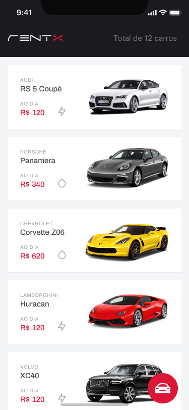
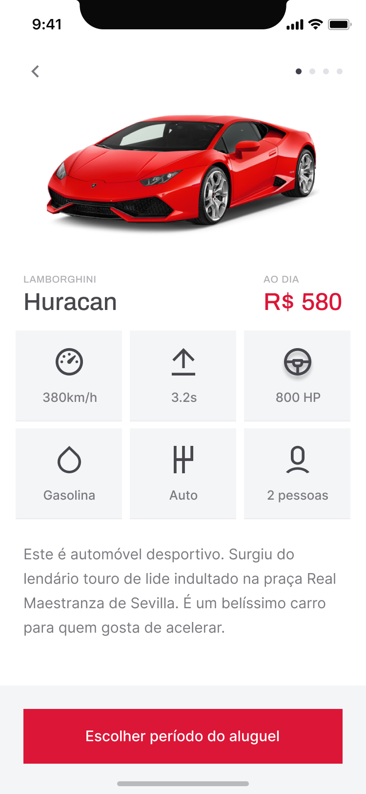
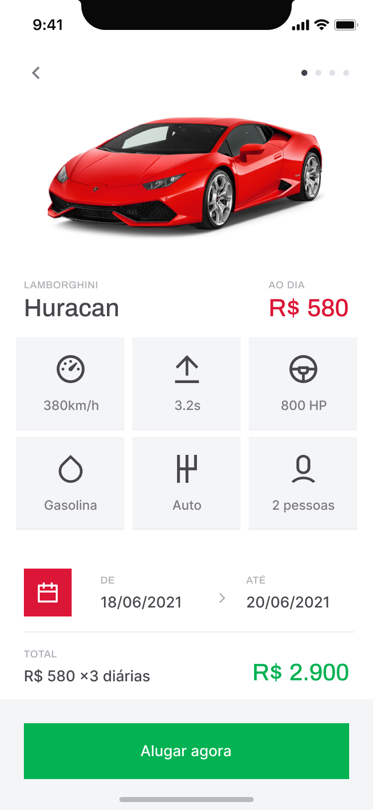

<h1 align="center" class="line-1 anim-typewriter"> Rentx React Native</h1>

<div align="center" width="100%">
         
          
         
         
                    
</div>

<br/>

<div align="center"  class="links">
        <a href="#challenge">challenge</a> |
        <a href="#built_with">built with</a> |
        <a href="#author">author</a> |
        <a href="#license">license</a> 
</div>

<br/>
<br/>

<h2 id="challenge"  align="center">⚡ The challenge </h2>

<div align="center">
        <p> React Native application that simulates car rental. </p>
</div>

<br/><br/>

> <h3> Links : </h3>

The Expo SDK provides access to device and system functionality ... [Learn More](https://docs.expo.dev/workflow/expo-cli/ "click to be redirected!").

TypeScript is a strongly typed programming language that builds on ... [Learn More](https://www.typescriptlang.org/ "click to be redirected!")

<br/><br/>

<h2 id="built_with"> 🧙‍♂️ Built with</h2>

<br>

<div align="center" class="container-icons">

<p float="left">


</p>
        
</div>

<br>

<br/>
<br/>
<br/>
<br/>

> <h3> Getting start : </h3>
> <br/>

<div>

1. <b>Clone the project</b>

```bash
 git clone https://github.com/gabriel-durr/rentx-rn.git && cd rentx-rn
```

 <br/>

2. <b>Install dependencies</b>

```bash
 yarn
```

 <br/>

3. <b>Start the application</b>

```bash
 expo start
```

 <br/>

</div>

<br>

<h5 id = "author" align="center"></h5>

<table align="center">
  <tr>
      <td>
      <a href="https://github.com/gabriel-durr">
        <br>
      </a>
      </td>
  </tr>
</table>

<div align="center">
        <sub><b><em>Made with 💜&ensp; by Gabriel Dürr </em></b></sub>
</div>

<br/>
<br/>
<br/>

<h2></h2>

<div align="center">
        
<h3 id="license" ></h3>

> This project is licensed under the &nbsp; [](LICENSE)

</div>
